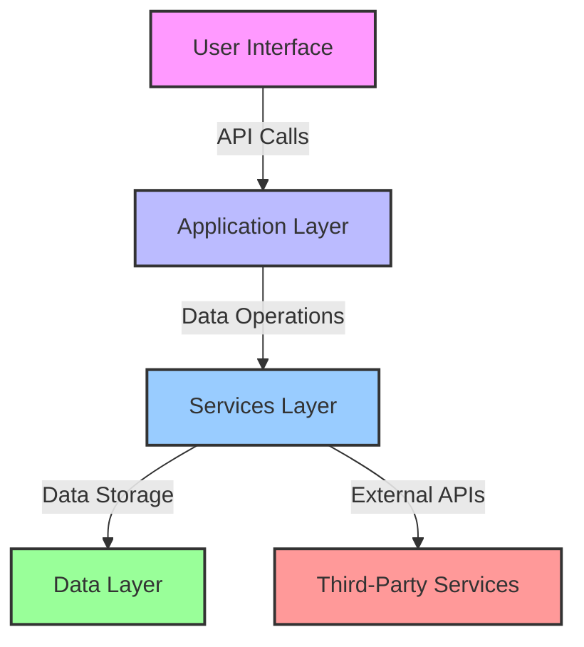
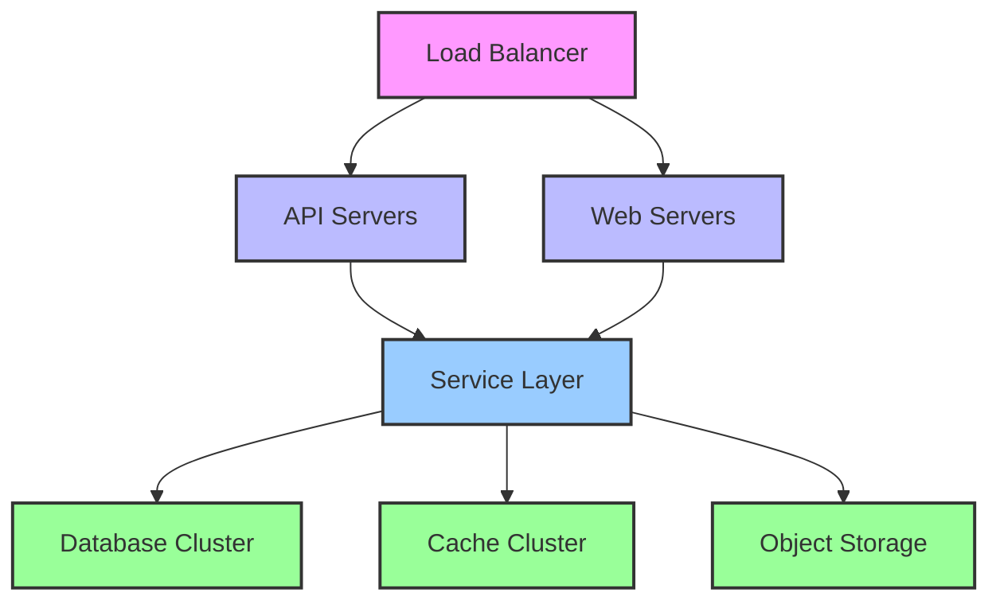

# System Architecture

This document provides an overview of the PrisMind system architecture, its components, and how they interact.

## High-Level Architecture

## Core Components

### 1. User Interface
- **Web Dashboard**: Streamlit-based interface for user interaction
- **CLI**: Command-line interface for automation and scripting
- **REST API**: For programmatic access to system functionality

### 2. Application Layer
- **Routers**: Handle HTTP requests and responses
- **Controllers**: Process user input and manage application flow
- **Authentication**: Handle user authentication and authorization

### 3. Services Layer

#### 3.1 Collection Services
- **Data Collection**: Gathers data from various social media platforms
  - Twitter: Extracts tweets and bookmarks
  - Reddit: Extracts saved posts and comments
  - Threads: Extracts saved content
- **Content Processors**: Clean and normalize collected data
- **Scheduling**: Manage periodic data collection tasks

#### 3.2 Analysis Services
- **NLP Processing**: Text analysis and entity extraction
- **Sentiment Analysis**: Determine sentiment of collected content
- **Trend Detection**: Identify emerging topics and patterns

#### 3.3 Storage Services
- **Database Manager**: Handle data persistence and retrieval
- **Cache Manager**: Improve performance with in-memory caching
- **File Storage**: Manage file uploads and storage

### 4. Data Layer
- **PostgreSQL**: Primary relational database
- **Redis**: Caching and real-time features
- **Object Storage**: For file storage (e.g., S3-compatible)

## Data Flow

1. **Data Collection**
   - Scheduled jobs trigger data collection
   - Collectors fetch data from configured sources
   - Raw data is stored with metadata

2. **Data Processing**
   - Content is cleaned and normalized
   - NLP and analysis are performed
   - Results are stored in the database

3. **Data Presentation**
   - UI components query processed data
   - Results are presented in dashboards and reports
   - Users can interact with and export data

## Integration Points

### External Services
- **Social Media Platforms**: Twitter, Reddit, etc.
- **AI/ML Services**: For advanced analysis
- **Notification Services**: Email, Slack, etc.
- **Storage Services**: S3, Google Cloud Storage

### APIs
- **REST API**: For external system integration
- **Webhooks**: For event-driven integrations
- **WebSockets**: For real-time updates

## Security Considerations

- **Authentication**: OAuth 2.0 and JWT
- **Authorization**: Role-based access control
- **Data Encryption**: At rest and in transit
- **Audit Logging**: All sensitive operations are logged

## Scalability

- **Horizontal Scaling**: Stateless services can be scaled out
- **Load Balancing**: Distribute traffic across instances
- **Caching**: Reduce database load
- **Async Processing**: For long-running tasks

## Monitoring and Logging

- **Metrics Collection**: System and application metrics
- **Log Aggregation**: Centralized logging
- **Alerting**: Proactive notification of issues
- **Tracing**: Distributed request tracing

## Deployment Architecture

## Technology Stack

- **Backend**: Python 3.9+
- **Web Framework**: FastAPI
- **Database**: PostgreSQL
- **Cache**: Redis
- **Search**: Elasticsearch
- **Queue**: Celery with Redis
- **Frontend**: Streamlit, React
- **Infrastructure**: Docker, Kubernetes
- **CI/CD**: GitHub Actions

## Future Considerations

- **Microservices Architecture**: For better scalability
- **Event Sourcing**: For audit and replay capabilities
- **Machine Learning Pipeline**: For advanced analytics
- **Multi-tenancy**: For SaaS offering
